# Anagrams Game!

The Anagrams Game is a Python terminal game, which runs in the Code Institute mock terminal in Heroku.

Users can try to solve five anagrams set at easy, medium or hard level of difficulty. After completing the game, users will see if they have achieved a place on the leaderboard and have an option to view the leaderboard before playing again or exiting.

[Here is the live version of the project](https://project-three-anagrams-e926f3ae0dcd.herokuapp.com/)

## How to play

This is the text the user will read if they select 'rules' as the first option in the game:

- You will be given five randomly generated words in the English language (with American spelling).
- The only problem is the letters have been jumbled up!
- You will need to try and work out what the word is.
- You have twenty seconds to solve each anagram.
- The quicker you solve the anagram the more points you will receive.
- For example, if you solve it with 12 seconds remaining you will score 12 points.
- If you score enough points your name will appear on the leaderboard.

## Features
The website has a number of features to aid the user experience:

### Rules
At the start, the user will be given the option of reading the rules. If they already know how to play they will be able to go straight to the game.

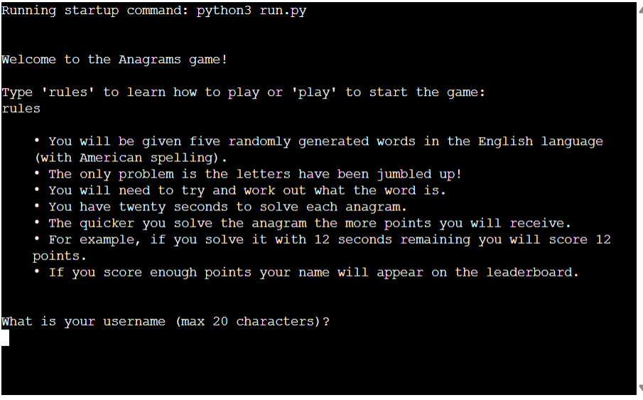

### Opportunity to enter your name
The user will have an opportunity to enter a username. This will later be used for the leaderboard. Characters are set to a maximum of 20 to avoid issues when presenting the leaderboard at a later stage.

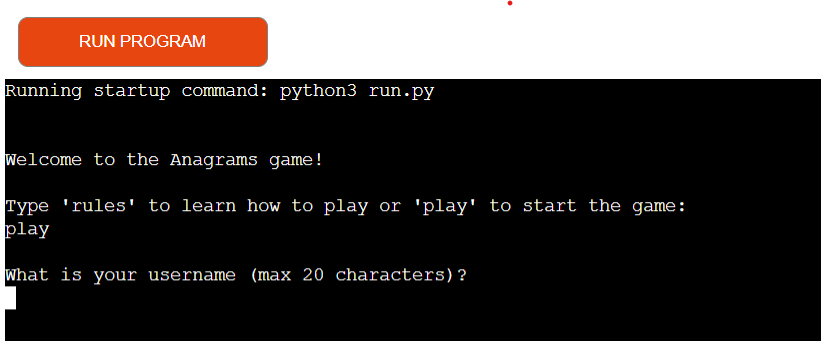

### A difficulty selector
Next, the user is able to select a difficulty level. This will determine the number of letters in the anagram.

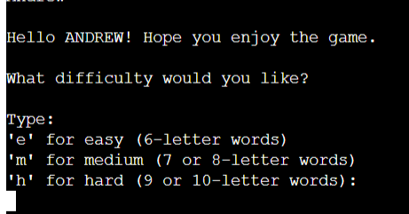

### Random word generation
A random word is generated from a list of words in a txt file, in a length inkeeping with the difficulty set. The letters are jumbled to create an anagram. Users have a time limit to correctly solve the anagram.

### Timer
The user has 20 seconds to solve the anagram before running out of time.

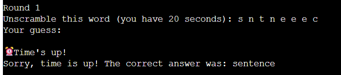

### A Solution Check
If an attempt is inputted as a solution, the program will check if it matches the original word and feedback appropriately. Correct answers will score points based on how many seconds are remaining.

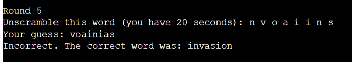

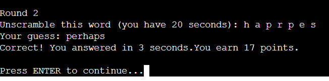

On rare occasions, the user may input a word that is in the txt file and a correct word in the English language but not the answer the program was expecting. In these occurences the program does check and feedback that the answer is correct.

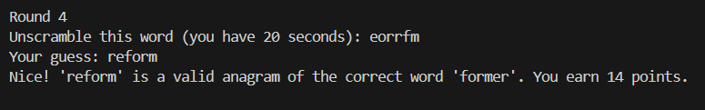

### A Score
After five anagrams, the program totals the score and checks to see if it has made the Google sheet used to store the leadboard data. It rearranges the data as necessary.

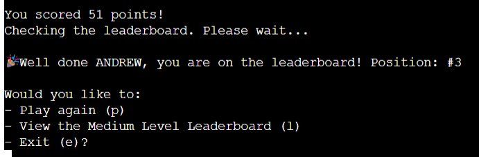

### A Leaderboard

The user is then given the opportunity to view a leaderboard, play again or exit. If the leaderboard has already been viewed this option is removed for the question after viewing it.

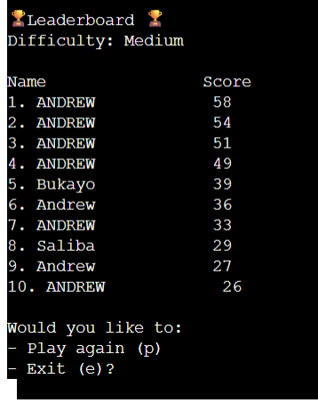

### Error Messages
Red Error messages are a feature that can be seen at various points in the game. They avoid errors that would have consequences at a later point in the program (such as a username with more than 20 characters) and give a clear message to the user about what they need to type for the game to continue. Colorama was implemented so that they could be written in red and stand out to the user.

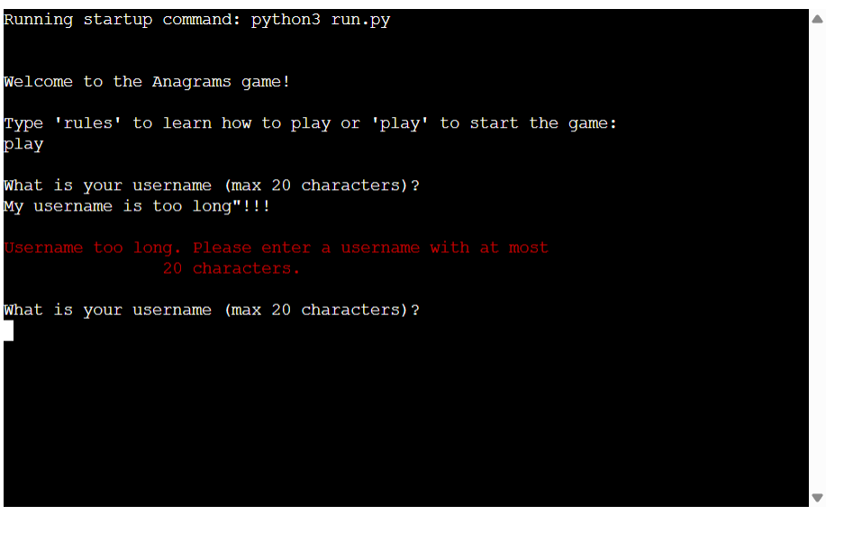

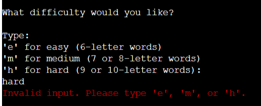

## Flowchart
This flowchart represents the logical flow of the program.

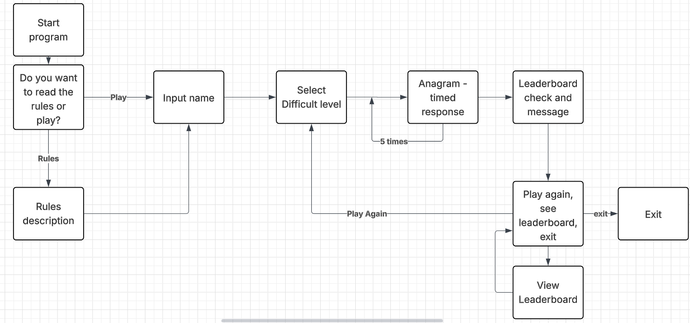

## Data Model
To improve readability and maintainability, I split my code into three separate .py files. I created a class (WordSelector) to handle reading and storing the word data from words.txt, which avoids the need to re-read the file every time a word is needed. This class also contains methods for selecting a word based on the chosen difficulty and jumbling the letters to create an anagram.

Using a class in this way helps separate word-handling logic from the main gameplay and leaderboard functionality, which are handled in their own modules. This structure not only keeps the code organised but also makes it easier to extend or modify the game in the future without major rewrites.

## Testing
A number of people have played the game to test for errors, including the designer and a Code Institute mentor. Attemps to 'break' the code were made to ensure all error messages appeared as expected. The program has been tested in the local terminal and the Code Institue Heroku terminal.

### Validation
All three .py modules have been passed through the Code Institute linter and confirmed no problems.

run.py

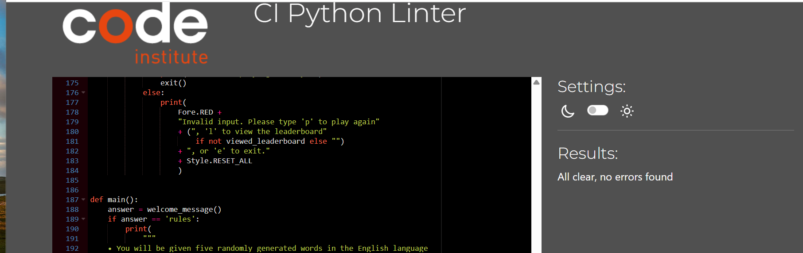

word_selector.py

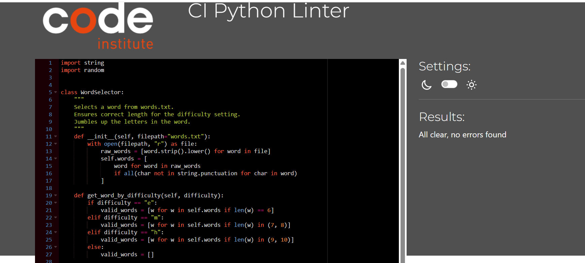

leaderboard.py

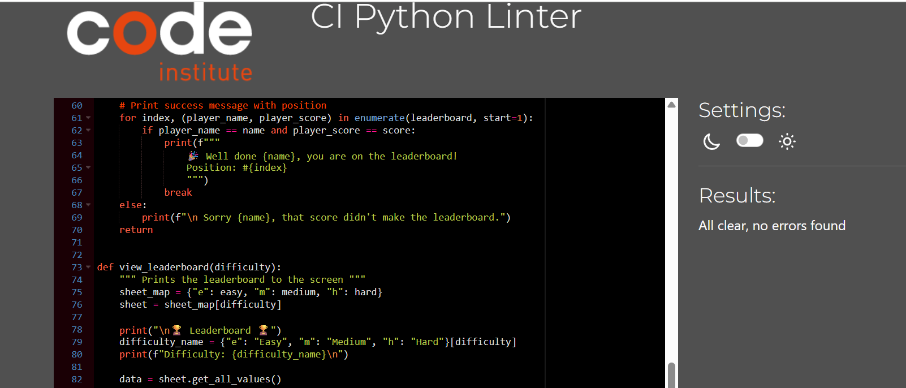

## Bugs
A number of bugs were found during the testing process at various occurences.

### Solved Bugs
After implementing the countdown timer and linking this with scoring, it was revealed that on occasions players were scoring one fewer point than they should have done when correctly solving an anagram. One particular test resulted in an anagram being solved in 19 seconds (1 second remaining) but scoring 0 points. This was due to the rounding method used to calculate the time remaining occasionally rounding down. Using math.ceil ensured that the time remaining is always rounded up, correcting the scoring.

Playtesting revealed that if a user attempted to type an answer just as the time was running out, then pressed enter once it had run out, this resulted in an answer being submitted for the next question which was inevitably incorrect. To fix this, a 'pause' was coded in to the program between the first four questions to ensure the user was ready to move on. 

### Remaining Bugs
There is still a bug relating to the words.txt file used. Currently, there are still occurences where a user will type in a correct answers that uses the right letters and is a word in the English language but is not in the words.txt file. On this occasion the program will check the txt file for other suitable answers but will not be able to find one. To completely aleviate this issue a much larger dictionary would need to be used to check answers. This dictionary could not be used for the generation of the words at it would regularly find obscure and unusual English words, which would be frustrating for the user.

## Future Features
- Implement a larger dictionary to fix the bug described above of anagrams of the correct word being considered incorrect.
- Implement a two player game.
- Create a visual countdown so players can see how many seconds are remaining as they solve an anagram.

## Deployment

For your own deployment of this project, you will need to create a leaderboard spreadsheet in your Google Drive. Be sure to share this spreadsheet with your Google Service Account's email address.
When deploying to Heroku (or running locally), you must provide your own creds.json file containing your Google Service Account credentials. This file is not included in the repository for security reasons.

### Clone from Github
1. Go to the repository on GitHub: [project-three-anagrams-game](https://github.com/andrewpmilne/project-three-anagrams-game)
2. Click the green **Code** button.
3. Copy the repository URL
4. Open your terminal or command prompt.
5. Navigate to the directory where you want to store the project.
6. Run the following command to clone the repository:

   bash
   git clone https://github.com/andrewpmilne/project-three-anagrams-game.git

### Create a Virtual Environment (using VS code)
1. Open the Command Palette (Ctrl + Shift + P on Windows or Cmd + Shift + P on macOS).
2. In the Command Palette type: Python: Create Environment.
3. Select Python: Create Environment from the list.
4. Select Venv from the drop down menu.
5. Check that your environment is active by editing an .py file and looking for ('venv': venv) near the bottom right hand corner of the screen.

### Install Dependencies
1. Ensure that there is a requirements.txt file in the root of the project folder.
2. In the terminal, run: pip install -r requirements.txt
3. Verify the installation with: pip list

### Deploy in Heroku

Reminder: You will need to create your own creds.json file to deploy to Heroku.
My creds.json file is not included in this project for security reasons.

1. Navigate to the [Heroku website](https://www.heroku.com) and log in to your account. Create an account if you don't have one.
2. Click on 'new' to create a new project.
3. Choose 'create new app' from the dropdown menu.
4. Name the app and choose a region.
5. Navigate to settings on the tab.
6. Click Reveal Config Vars.
7. Add a config var with a key of CREDS (capitals).
8. Go to the creds.json file you created and paste the details into the value field of the config var.
9. Click add.
10. Create another config var with a key of PORT and a value of 8000.
11. Scroll down to Buildpacks and click add buildpack.
12. Add the buildpack called Python.
13. Add the buildpack called nodejs.
14. In this list of buildpacks, ensure Python is above nodejs.
15. Scroll back to the top and click on the deploy section.
16. In the deployment section click GitHub.
17. In the Connect to GitHub section type in the name you have called your project.
18. Click connect.
19. Scroll down and choose either 'Enable Automatic Deploys' or 'Deploy Branch'.
20. Wait whilst the project deploys, then click on 'view' to check it is working.

## Technologies Used
- Python libraries:
   - [Colorama](https://pypi.org/project/colorama/) used to add red validation messages.
   - [inputimeout](https://pypi.org/project/inputimeout/) used to create a time limit for solving anagrams.
   - [gspread](https://pypi.org/project/gspread/) used to link a Google sheet with the leaderboard data.
- The project also uses Python’s standard library modules such as string, math, random, and time.
- [Lucidchart](https://www.lucidchart.com) was used to create the flowchart.
- [Visual Studio Code](https://code.visualstudio.com) was used as the integrated development environment (IDE) for writing, editing, and debugging the code.
- [Git](https://git-scm.com) was used as the version control system to manage and track changes in the code. 
- [GitHub](https://github.com) served as the remote platform to host the repository.
- [Heroku](https://www.heroku.com) was used as the cloud platform to deploy and host the application.
- [ChatGPT](https://chat.openai.com) was used for debugging assistance during development.

## Credits
List of 3000 common English words found through [université paris cité](https://python.sdv.u-paris.fr/data-files/english-common-words.txt)

## Acknowledgements
Thanks, once again, to Juliia Konovalova for Slack calls and advice whilst nine months pregnant!
My friend, John Holland, for playtesting the game and occasionally getting on the leaderboard!
